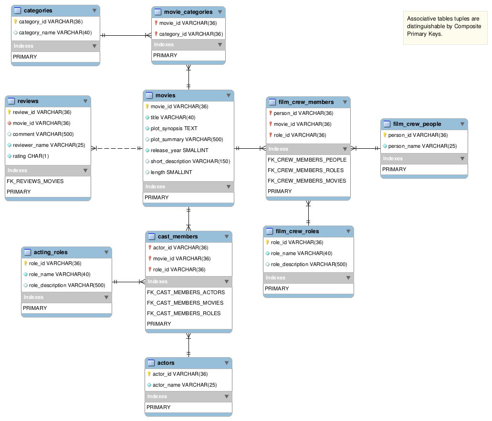

## Spring Boot Movies API

This application is the backend support of two other applications: [movies website](../003-frontend-react-site), 
and [movies site admin](../004-frontend-react-admin). It can be started as any Spring Boot application. Database will 
be available after Docker container initialization. Flyway will create the Tables, and populate them for you with fake data, 
during the application initialization.

To make the application available, just do as follows:

---
**NOTE**

```For just running the application, do it within a Docker container. Jump straight to the item 3.2 to se how.```

---

1. [x] Application compilation, building, and packaging (for standalone only):  
	- ```mvn package```
2. [x] Infrastructure (pgAdmin & postgres)
	    - ```docker-compose up -d pgamin database```     
	1. Data Scheme (tables):  
        Flyway will create everything during the application initialization. 
3. Run the application:    
    1. Standalone (with Java 14)
        - ```java -jar target/spring-movies-api-1.0.jar ```  
    2. Withing a Docker container
        - ```docker-compose up -d webapp```    
4. [Open the application on your browser.](http://localhost:8080/)
    - The root resource lists all available resources.
    ```json
        {
           "movies":"http://localhost:8080/movies",
           "actors":"http://localhost:8080/actors",
           "film_crew_roles":"http://localhost:8080/film-crew/roles",
           "film_crew_people":"http://localhost:8080/film-crew/people",
           "movies_reviews":"http://localhost:8080/movies/{movie_id}/reviews",
           "acting_roles":"http://localhost:8080/acting/roles"
        }
    ```

****
#### Data Access



If you want to follow straight on **Postgres**, you can use **PgAdmin**.  

 - ```docker-compose up -d pgamin```

###### PgAdmin  
 - [PgAdmin4 Address](http://localhost:5050)   
 - **username**: pgadmin4@pgadmin.org  
 - **password**: admin  

###### Database Info
 - **Port**: 5432  
 - **Host**: database (within the container) | localhost (development)  
 - **Password**: postgres  
 - **Username**: postgres  
 - **Database**: spring_movies_api  

